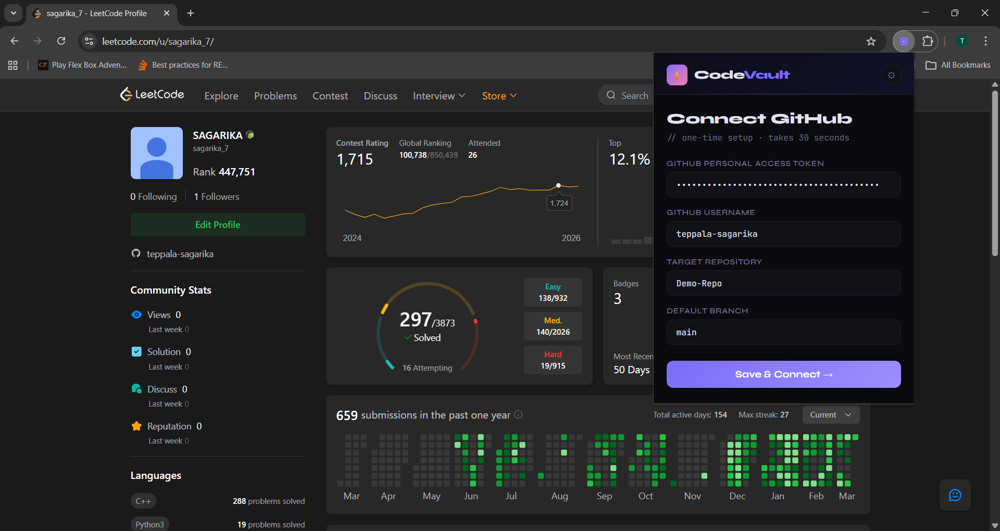
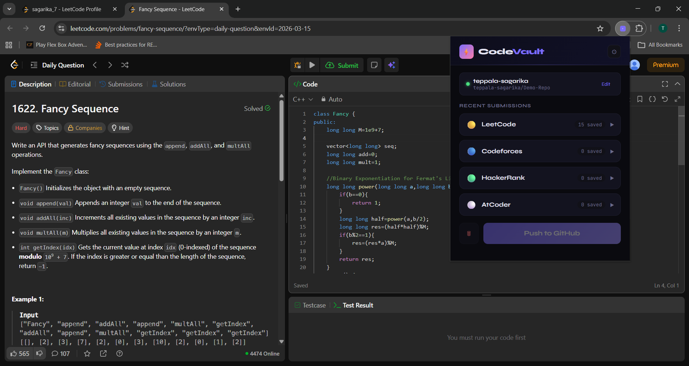
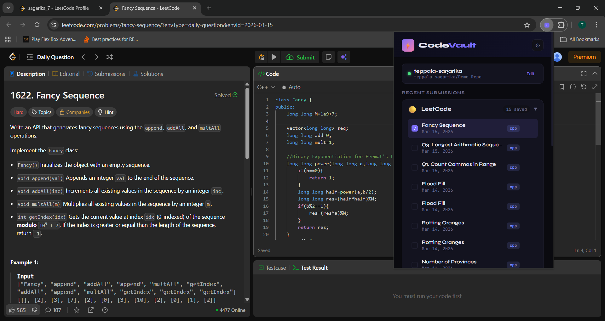
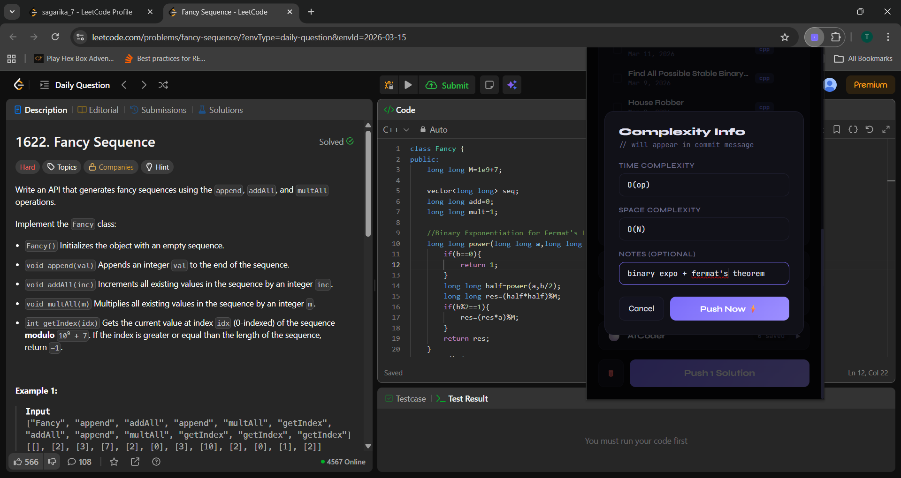
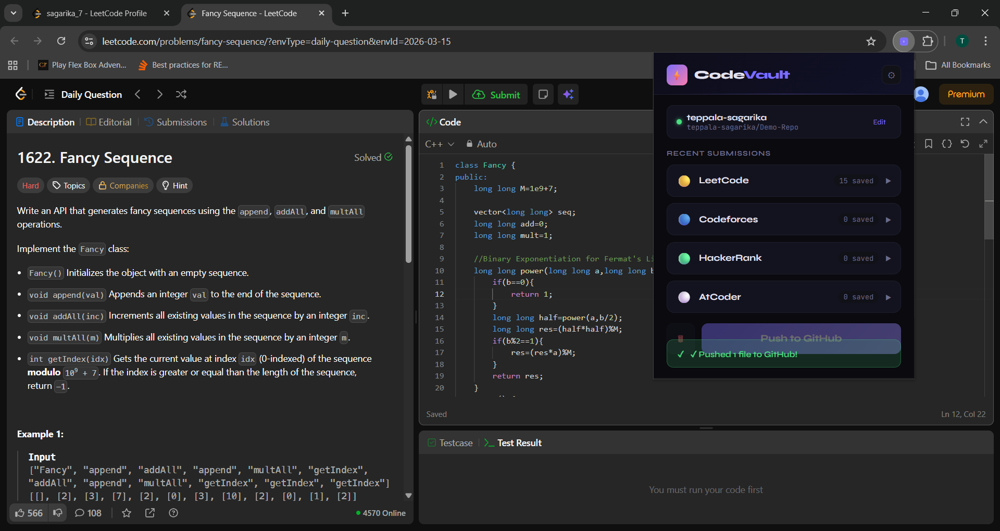
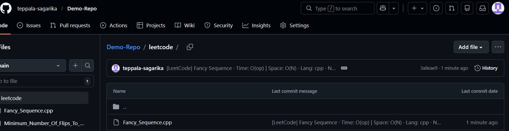

# 🔐 CodeVault

**CodeVault** is a Chrome extension that automatically saves your solved LeetCode problems to your GitHub repository. It helps developers maintain a structured archive of their coding practice and track their progress over time.

---

## 🚀 Features

* Automatically push solved LeetCode problems to GitHub
* Store problem metadata such as title, difficulty, and description
* Use personal GitHub access tokens for authentication
* Maintain an organized repository of coding solutions
* Store multiple submission versions
* Manually select and push the correct solution to GitHub
* Simple and lightweight Chrome extension

---

## 🛠️ Tech Stack

* **JavaScript**
* **HTML**
* **CSS**
* **Chrome Extension APIs**
* **GitHub REST API**

---

## 📦 Installation

1. Clone the repository

```
git clone https://github.com/your-username/codevault.git
```

2. Open **Chrome** and go to

```
chrome://extensions/
```

3. Enable **Developer Mode** (top right corner)

4. Click **Load Unpacked**

5. Select the project folder

The extension will now appear in your Chrome extensions list.

---

## 🔑 Setup

1. Generate a **GitHub Personal Access Token**
2. Open the CodeVault extension
3. Paste your GitHub token in the input field
4. Select or create a repository where your solutions will be stored

---

## ⚙️ How It Works

1. Solve a problem on LeetCode
2. After submission, CodeVault detects the solution
3. The extension collects problem details and your code
4. It automatically creates a commit in your GitHub repository

This helps you maintain a version-controlled archive of your coding journey.

---
## 📸 How the Chrome Extension Works (Screenshots)

### 1️⃣ Connect GitHub
Connect your GitHub account so the extension can push your solved problems automatically.



### 2️⃣ Extension Interface
Open the extension popup to access the main interface.



### 3️⃣ Select the Problems You Want to Add
Choose the coding problems you want to store in your GitHub repository.



### 4️⃣ Mention Complexity and Notes
Add time complexity, space complexity, and personal notes.



### 5️⃣ Click Push to GitHub (Success Message Appears)
Click Push to GitHub and a confirmation message appears.



### 6️⃣ Repository Where It Got Added
View the uploaded solution in your GitHub repository.


---

## 📂 Example Repository Structure

```
LeetCode-Solutions
│
├── Two-Sum
│   └── solution.cpp
│
├── Longest-Substring-Without-Repeating-Characters
│   └── solution.cpp
│
└── README.md
```

---

## 🌟 Future Improvements

* Support for multiple coding platforms
* Difficulty-based folder organization

---

## 🤝 Contributing

Contributions are welcome!
Feel free to fork the repository and submit a pull request.
